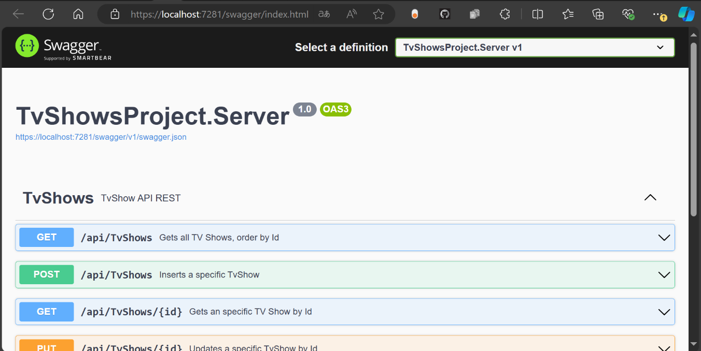

# TV Shows API - Code Challenge

This project was build using an **“Angular and ASP.NET Core 8”** project on Visual Studio 2022, and additional the **Entity Framework** was used to map the high-level data access layer with .NET (C#).

**Swagger** was used to debug the endpoints and generate the documentation.

When the server is running, you can check the Swagger UI on **https://localhost:<port>/swagger/index.html**, where <port> is a randomly chosen port number set at the project creation (in a localhost case was 7281).

For the frontend, the only external dependence used was Bootstrap.

You can use **https://127.0.0.1:4200/** for viewing the web page.

## Activities Log
### Backend
1.	Adding of Microsoft.EntityFrameworkCore.InMemory for InMemory database (Herramientas -> Administrador de paquetes NuGet -> Administrar paquetes NuGet para solucion -> Examinar -> Buscar “Microsoft.EntityFrameworkCore.InMemory” -> Seleccionar el Proyecto -> Instalar). 
2.	Creation of folder “Models”
3.	Creation of Model “TvShow”, with the attributes Id, Name and Favorite. 
4.	Creation of DbContext “TvShowContext” for the Model.
5.	Adding of the Dependency injections for the model and the Entity Framework in Program.cs
6.	Creation of the Controller “TvShowController” using Scaffolding and the Entity Framework
7.	Edition of the “PostTvShow” endpoint, to change the action name, using nameof to avoid hardcoding.
8.	Deletion of the Model and Controller “WeatherForecast” files that come default with the project. 
9.	Sedding of the in memory database using the Entity Framework.
  a.	Adding the overrided function “OnModelCreating” with the seeds.
  b.	In Programs.cs call the Database.EnsureCreated() function on the DbContext to apply the seeded data on start up.
10.	Adding of a “getFavorites” endpoint in the controller to get all the shows that are marked as favorites or non favorites, it receives a bool as parameter.
11.	Adding of the property <GenerateDocumentationFile>true</GenerateDocumentationFile> 
to the “.csproj” file, to generate an XML documentation from the code comments.
12.	Adding “IncludeXmlComments” to the AddSwaggerGen function in the Programs.cs file

### Frontend

13.	Adding Bootstrap to the Angular Project.
14.	Editing the default app component (app.component) to add the router-outlet.
15.	Creating the home (select and delete), insert, and update components (CRUD operations).
16.	Add the routes to the app-routing.module.ts
17.	Edit home component to load the data from TvShow API on a CRUD table.
18.	Edit insert component to show a form to insert data using the API POST method.
19.	Edit update component to show a form with the select TV Show and with the capabilities to update the info.
20.	Edit again the home component to add the delete functionality (before selecting the option the user is asked to confirm).

